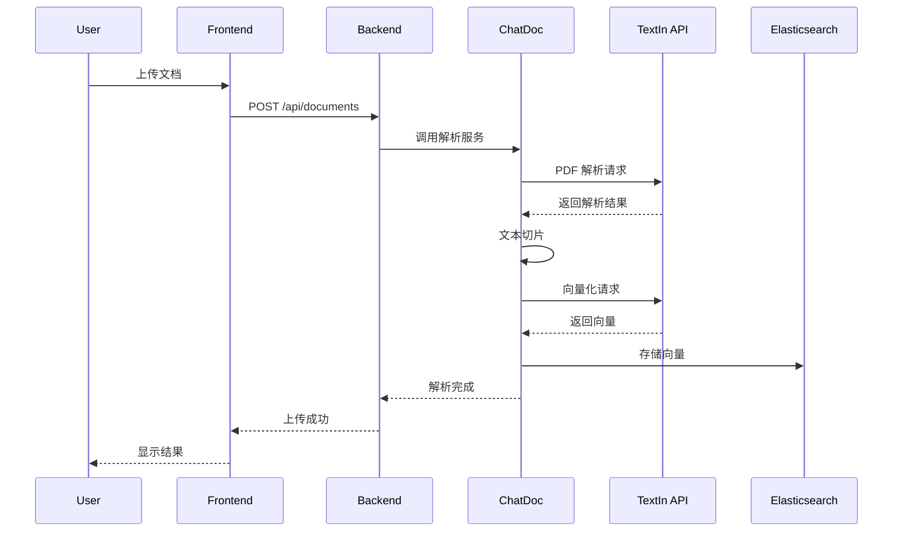
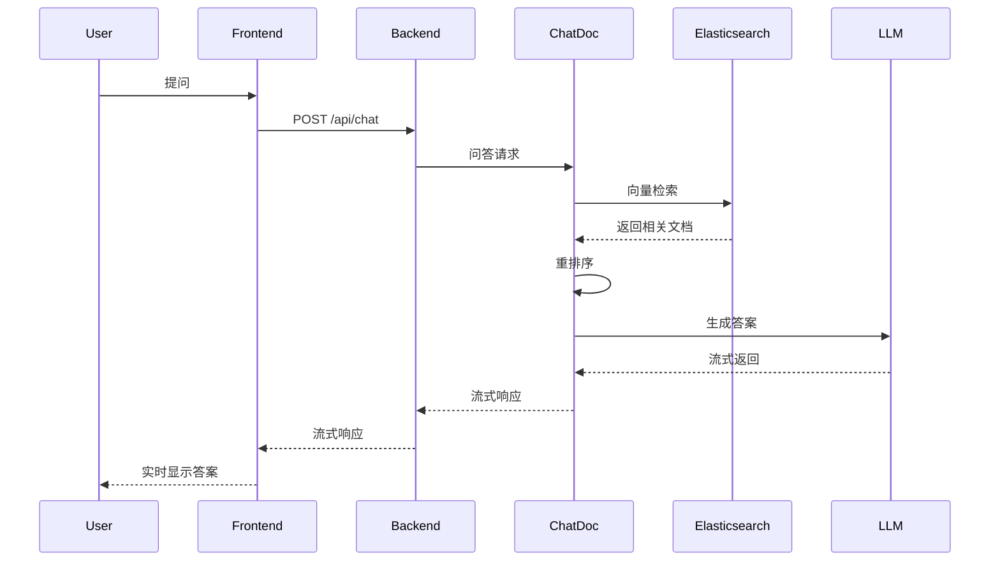

# ChatDoc Stack 代码结构详细分析

## 项目目录结构

```
chatdoc_stack/
├── code/
│   ├── frontend/           # Vue.js 前端应用
│   ├── backend/            # NestJS 后端服务
│   ├── chatdoc/            # Python 文档处理服务
│   ├── chatdoc-proxy/      # FastAPI 代理服务
│   └── megaparse/          # Megaparse 本地解析服务
├── compose/                # Docker Compose 配置
├── docs/                   # 项目文档
└── README.md
```

## Frontend (前端服务) 详细分析

### 技术栈和依赖

<augment_code_snippet path="code/frontend/package.json" mode="EXCERPT">
````json
{
  "name": "intfinq-frontend",
  "dependencies": {
    "@ant-design-vue/nuxt": "^1.4.1",
    "@nuxt/image": "^1.7.0",
    "@pinia/nuxt": "^0.5.1",
    "nuxt": "^3.12.4",
    "vue": "latest"
  }
}
````
</augment_code_snippet>

### 核心配置

<augment_code_snippet path="code/frontend/nuxt.config.ts" mode="EXCERPT">
````typescript
export default defineNuxtConfig({
  modules: [
    '@ant-design-vue/nuxt',
    '@pinia/nuxt',
    '@nuxt/image',
    '@vueuse/nuxt',
    '@nuxtjs/tailwindcss'
  ],
  runtimeConfig: {
    public: {
      apiBase: '' // 后端 API 地址
    }
  }
})
````
</augment_code_snippet>

### 目录结构说明

| 目录 | 功能 | 关键文件 |
|------|------|----------|
| `components/` | 可复用组件 | 文档预览、问答界面组件 |
| `pages/` | 页面路由 | 主页、问答页、历史记录页 |
| `store/` | 状态管理 | 用户状态、文档状态 |
| `api/` | API 接口封装 | 文档上传、问答接口 |
| `assets/` | 静态资源 | 样式文件、图片 |

## Backend (后端服务) 详细分析

### 技术栈和依赖

<augment_code_snippet path="code/backend/package.json" mode="EXCERPT">
````json
{
  "dependencies": {
    "@nestjs/common": "^10.0.0",
    "@nestjs/core": "^10.0.0",
    "@nestjs/typeorm": "^10.0.0",
    "@nestjs/swagger": "^7.1.14",
    "mysql2": "^3.6.1",
    "jsonwebtoken": "^9.0.2"
  }
}
````
</augment_code_snippet>

### 模块架构

<augment_code_snippet path="code/backend/src/app.module.ts" mode="EXCERPT">
````typescript
@Module({
  imports: [
    TypeOrmModule.forRoot({...baseConfig}),
    CacheModule.registerAsync(CacheRedisOptions),
    UserModule,
    LibraryModule,
    DocumentModule,
    ChatModule,
    RecycleModule
  ]
})
export class AppModule {}
````
</augment_code_snippet>

### 核心模块功能

| 模块 | 功能 | 主要实体 |
|------|------|----------|
| `UserModule` | 用户管理、认证授权 | User, Role |
| `DocumentModule` | 文档管理、上传下载 | Document, File |
| `ChatModule` | 对话管理、问答记录 | Chat, Message |
| `LibraryModule` | 知识库管理 | Library, Folder |

### 数据库设计

主要数据表：
- `users` - 用户信息
- `documents` - 文档元数据
- `chats` - 对话记录
- `libraries` - 知识库信息
- `folders` - 文件夹结构

## ChatDoc (文档处理服务) 详细分析

### 服务架构

<augment_code_snippet path="code/chatdoc/main.py" mode="EXCERPT">
````python
from flask import Flask, request, Response
from pkg.personal import process as personal_process
from pkg.analyst import process as analyst_process
from pkg.global_ import process as global_process

app = Flask(__name__)

@app.route("/api/v1/personal/infer", methods=["POST"])
def infer_personal():
    # 个人知识库问答
    
@app.route("/api/v1/analyst/infer", methods=["POST"])
def infer_analyst():
    # 分析师问答
    
@app.route("/api/v1/global/infer", methods=["POST"])
def infer_global():
    # 全局知识库问答
````
</augment_code_snippet>

### 核心包结构

| 包 | 功能 | 关键模块 |
|-----|------|----------|
| `pkg/doc/` | 文档解析处理 | `pdf2md.py`, `doc_parse.py` |
| `pkg/personal/` | 个人知识库 | `process.py`, `retrieve.py` |
| `pkg/analyst/` | 分析师问答 | `process.py`, `rerank_by_answer.py` |
| `pkg/embedding/` | 向量化处理 | `acge_embedding.py` |
| `pkg/rerank/` | 重排序 | `__init__.py` |
| `pkg/clients/` | 外部服务客户端 | `textin_ocr.py` |

### 文档处理流程

<augment_code_snippet path="code/chatdoc/pkg/doc/pdf2md.py" mode="EXCERPT">
````python
@register_span_func(func_name="文档解析")
def pdf2md(context: Context) -> Context:
    # 1. 检查缓存
    if not context.params.force_doc_parse and local_or_remote_exist(context.doc_parse_path):
        # 使用缓存结果
        pass
    else:
        # 2. 调用 TextIn API 解析
        context.doc_parse_result, context.page_base64_imgs = document_parse(
            context.org_file_path, 
            config["parse"]["doc_parse_url"]
        )
        # 3. 保存结果
        upload_doc_parser(doc_result_json, context.doc_parse_path)
````
</augment_code_snippet>

### 向量化处理

<augment_code_snippet path="code/chatdoc/pkg/embedding/acge_embedding.py" mode="EXCERPT">
````python
@retry_exponential_backoff()
def acge_embedding_multi(text_list, dimension=1024, digit=8):
    json_text = {
        "input": text_list,
        "matryoshka_dim": dimension,
        "digit": digit
    }
    headers = {
        "x-ti-app-id": config["textin"]["app_id"],
        "x-ti-secret-code": config["textin"]["app_secret"],
    }
    completion = requests.post(url=config["textin"]["embedding_url"], 
                               headers=headers, json=json_text)
````
</augment_code_snippet>

## ChatDoc-Proxy (代理服务) 详细分析

### 服务功能

<augment_code_snippet path="code/chatdoc-proxy/app/main.py" mode="EXCERPT">
````python
from fastapi import FastAPI
from app.controller.embedding_and_upload import embedding_and_upload
from app.services.es import global_es

app = FastAPI()

@app.post("/vector/upload")
async def upload_vdb(vector_params: list[TextWithoutVecEntity]):
    # 批量向量化并上传到向量数据库
    embedding_and_upload(vector_params)

@app.post("/es_proxy/search")
async def es_proxy_search(body: dict):
    # ES 搜索代理
    return global_es.search(index, search_body)
````
</augment_code_snippet>

### 核心服务模块

| 模块 | 功能 | 文件 |
|------|------|------|
| `embedding` | 向量化服务 | `app/services/embedding.py` |
| `es` | Elasticsearch 操作 | `app/services/es.py` |
| `backup_images` | 图片备份 | `app/services/backup_images.py` |
| `retrieve` | 检索服务 | `app/services/retrieve.py` |

## 配置管理分析

### ChatDoc 配置结构

<augment_code_snippet path="code/chatdoc/config.yaml" mode="EXCERPT">
````yaml
# TextIn API 配置
textin:
  app_id: 'xxxx'
  app_secret: 'xxxxx'
  embedding_url: 'https://api.textin.com/ai/service/v1/acge_embedding'
  rerank_url: 'https://api.textin.com/ai/service/v1/rerank'

# PDF 解析配置
pdf2md:
  url: 'https://api.textin.com/ai/service/v1/pdf_to_markdown'
  options_dpi: 144
  options_page_count: 2000

# 向量数据库配置
es:
  hosts: 'http://localhost:9200'
  username: 'elastic'
  password: 'password'
````
</augment_code_snippet>

### 环境变量管理

<augment_code_snippet path="code/chatdoc/pkg/config.py" mode="EXCERPT">
````python
def rewrite_config_with_env(config, all_env):
    """使用环境变量覆盖配置文件"""
    for key in all_env:
        value = os.getenv(key)
        if value:
            a = key.split("_", 1)
            config[a[0].lower()][a[1].lower()] = value
    return config
````
</augment_code_snippet>

## API 接口设计

### 文档解析接口

```http
POST /api/v1/personal/infer
Content-Type: application/json

{
  "question": "用户问题",
  "document_ids": ["doc1", "doc2"],
  "stream": true
}
```

### 向量化接口

```http
POST /vector/upload
Content-Type: application/json

[
  {
    "text": "文本内容",
    "document_id": "doc_id",
    "chunk_id": "chunk_id"
  }
]
```

### 检索接口

```http
POST /es_proxy/search
Content-Type: application/json

{
  "index": "knowledge_base",
  "search_body": {
    "query": {...},
    "size": 10
  }
}
```

## 数据流分析

### 文档上传流程



### 问答流程



## 错误处理和监控

### 重试机制

<augment_code_snippet path="code/chatdoc/pkg/utils/__init__.py" mode="EXCERPT">
````python
def retry_exponential_backoff(max_retries=3, base_delay=1):
    def decorator(func):
        @wraps(func)
        def wrapper(*args, **kwargs):
            retries = 0
            while retries < max_retries:
                try:
                    return func(*args, **kwargs)
                except requests.exceptions.RequestException as e:
                    wait_time = base_delay * (2 ** retries)
                    logger.warning(f"请求失败，{wait_time}秒后重试...{e}")
                    time.sleep(wait_time)
                    retries += 1
            raise Exception("达到最大重试次数，请求失败")
````
</augment_code_snippet>

### 日志记录

项目使用结构化日志记录：
- 请求/响应日志
- 性能指标日志
- 错误异常日志
- 业务操作日志

## 部署架构

### Docker 容器化

每个服务都有独立的 Dockerfile：
- `frontend/Dockerfile` - Nuxt.js 应用
- `backend/Dockerfile` - NestJS 应用
- `chatdoc/Dockerfile` - Python Flask 应用
- `chatdoc-proxy/Dockerfile` - FastAPI 应用

### 服务依赖

```yaml
# docker-compose.yml 依赖关系
services:
  frontend:
    depends_on: [backend]
  backend:
    depends_on: [mysql, redis]
  chatdoc:
    depends_on: [elasticsearch, redis]
  chatdoc-proxy:
    depends_on: [elasticsearch]
```

## 性能优化

### 缓存策略

1. **Redis 缓存** - 用户会话、临时数据
2. **LRU 缓存** - 向量化结果、重排序结果
3. **文件缓存** - 解析结果、图片文件

### 并发处理

1. **异步处理** - FastAPI 异步接口
2. **线程池** - 文档解析并发
3. **批处理** - 向量化批量处理

### 资源管理

1. **连接池** - 数据库连接池
2. **内存管理** - 大文件流式处理
3. **磁盘管理** - 临时文件清理

通过以上详细的代码结构分析，可以全面了解 ChatDoc Stack 项目的技术架构、核心功能和实现细节，为后续的开发和维护提供重要参考。
